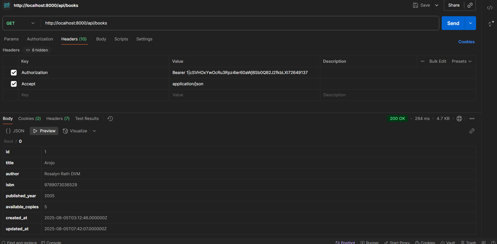

#  Laravel API Integration (App1 & App2)

This setup involves two Laravel applications
- App1: The API provider (exposes book data using Sanctum tokens)
- App2: The consumer app (fetches book data from App1 API and displays it on the dashboard)

## App 1 (API)
using sanctum

### 1. install prerequisites
```
php artisan install:api
```

this will generate a file called `api.php` in <u>/routes</u>

it also create a migration file called <u>create_personal_access_tokens_table.php</u>

### 2. modify user model

`User.php`

```php

//add this
use Laravel\Sanctum\HasApiTokens;

class User extends Authenticatable
{
    //and add HasApiTokens here
    use HasFactory, Notifiable, HasApiTokens;

    ...
}
```

### modify auth.php

this file can be found in <u>/config</u>

add this in 'guards'
```php
'api' => [
    'driver' => 'sanctum',
    'provider' => 'users',
],
```
```php
'guards' => [
    'web' => [
        'driver' => 'session',
        'provider' => 'users',
    ],
    //add here
],
```

### 3. create api controller `php artisan make:controller`

example: `BookController.php`
```php
<?php

namespace App\Http\Controllers;

use Illuminate\Http\Request;
use App\Models\Book;

class BookApiController extends Controller
{
    public function index()
    {
        return response()->json(Book::all());
    }

    public function store(Request $request)
    {
        $book = Book::create($request->validate([
            'title' => 'required|string',
            'author' => 'required|string',
            'isbn' => 'required|string|unique:books',
            'published_year' => 'required|string',
            'available_copies' => 'required|integer',
        ]));

        return response()->json($book, 201);
    }

    public function show(string $id)
    {
        $book = Book::findOrFail($id);
        return response()->json($book);
    }

    public function update(Request $request, string $id)
    {
        $book = Book::findOrFail($id);
        $book->update($request->validate([
            'title' => 'sometimes|required|string',
            'author' => 'sometimes|required|string',
            'isbn' => 'sometimes|required|string|unique:books,isbn,' . $book->id,
            'published_year' => 'sometimes|required|string',
            'available_copies' => 'sometimes|required|integer',
        ]));

        return response()->json($book);
    }

    public function destroy(string $id)
    {
        $book = Book::findOrFail($id);
        $book->delete();

        return response()->json(['message' => 'Book deleted']);
    }
}

```

### 4. add controller in `api.php`


```php
use Illuminate\Support\Facades\Route;
use App\Http\Controllers\BookApiController;

//secured api using sanctum middleware
Route::middleware('auth:sanctum')->group(function () {
    Route::apiResource('books', BookApiController::class);
});

//unsecured api
Route::apiResource('books', BookApiController::class);
```

### 5. create Static Personal Access Token (PAT)
in terminal type `php artisan tinker` and paste this code

```php
$user = \App\Models\User::create([
    'name' => 'API User',
    'email' => 'api@example.com',
    'password' => bcrypt('secret'),
]);

```

after that paste this also
```php
$token = $user->createToken('staticApiToken')->plainTextToken;

```

*after that it will print the plain text token copy that and store that somewhere secured later it will be used by App 2 for requesting data from App 1*

token example: `"1|cSVHOxYwOcRu3Rpz4ler60aWjBSb0QB2J2fkbLXI72649137"`

## App 2 (Fetching)

### 1 install guzzle

in terminal paste: 
```
composer require guzzlehttp/guzzle
```

### 2 add ENV keys
```
REMOTE_API_TOKEN=1|cSVHOxYwOcRu3Rpz4ler60aWjBSb0QB2J2fkbLXI72649137
REMOTE_API_URL=http://localhost:8000/api
```

### 3. create a controller taht fetch the data from the API

```php
class RemoteBookController extends Controller
{
    public function dashboard()
    {
        $response = Http::withToken(env('REMOTE_API_TOKEN'))
            ->acceptJson()
            ->get(env('REMOTE_API_URL') . '/books');

        if ($response->successful()) {
            $books = $response->json();
            return view('dashboard', compact('books'));
        }
        abort(500, 'Failed to fetch books from API');
    }
}
```

## Testing the API

to test the api if its working you can use postman

